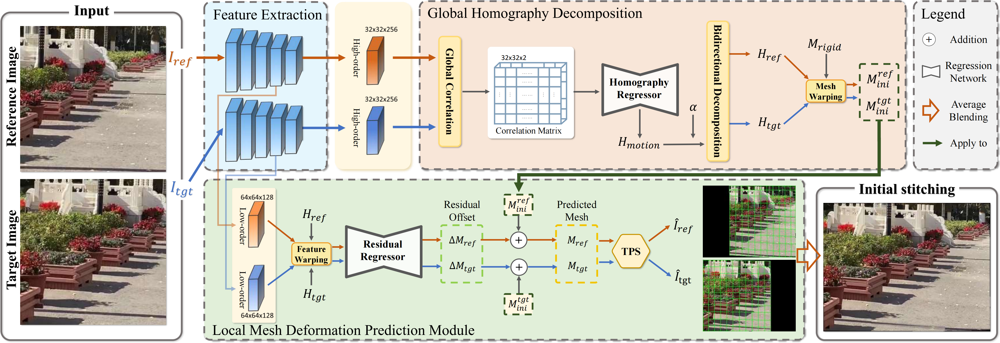

<h1>
  Revisiting Unsupervised Image Stitching via Differential Boundary Rectification
</h1>

<p align="center">
  
</p>

> **[Revisiting Unsupervised Image Stitching via Differential Boundary Rectification](https://arxiv.org/???)**
>
> [Yun Zhang](https://yunzhang-cuz.github.io), [Jialing Yang](), [Ruiyang Liang](), [Yao Xu](), [Lang Nie](https://nie-lang.github.io/), [Fang-Lue Zhang](), [Jinyu Xu](), [Xinyuan Zheng]()
>


## Dataset
We use the UDIS-D dataset to train and evaluate our method. Please refer to [UDIS](https://github.com/nie-lang/UnsupervisedDeepImageStitching) for more details about this dataset. The out-of-domain dataset refers to the self-built dataset, which consists of 143 pairs of images in total, and the associated dataset is available for download [Google Drive](https://drive.google.com/drive/folders/1v5l9HFlz5DdA205v2iPqUBO99i0-HT01?usp=sharing) or [Baidu Cloud](https://pan.baidu.com/s/18uD0g4RZMHQ0K1M0L023eQ?)(Extraction code: ystc).


## Code
#### 🖥️ Requirement
numpy >= 1.19.5

pytorch >= 1.7.1

scikit-image >= 0.15.0

tensorboard >= 2.9.0

## ✈️ Training

```
python train.py
```

## 🖼️ Testing 
Our pretrained models can be available at [Google Drive](https://drive.google.com/drive/folders/1v5l9HFlz5DdA205v2iPqUBO99i0-HT01?usp=sharing) or [Baidu Cloud](https://pan.baidu.com/s/18uD0g4RZMHQ0K1M0L023eQ?)(Extraction code: ystc).

```
python test.py
```

## 🖼️ Fine-tuning

```
python test_ft.py
```

## 📚 Citation

If you find BRecStitch useful for your research or applications, please cite our paper using the following BibTeX:

```bibtex
  
```

## Meta
If you have any questions about this project, please feel free to drop me an email.

Jialing Yang -- yangjialing22@gmail.com
